# На зеленый - первые 20 авторских пояснений

Вопросы и ответы - из первого официального билета. Пояснения - авторские.

## Билет 1 - вопрос 1

В каком случае водитель совершит вынужденную остановку?

1. Остановившись непосредственно перед пешеходным переходом, чтобы уступить дорогу пешеходу.

2. Остановившись на проезжей части из-за технической неисправности транспортного средства. **Верный ответ.**

3. В обоих перечисленных случаях.

**Пояснение:** Вынужденная остановка - когда дальше ехать мешает проблема: например, машина сломалась. Пропустить пешехода - обычное выполнение правил, а не вынужденная остановка. Здесь подходит вариант с неисправностью.

ПДД, п. 1.2

## Билет 1 - вопрос 2

Разрешен ли Вам поворот на дорогу с грунтовым покрытием?

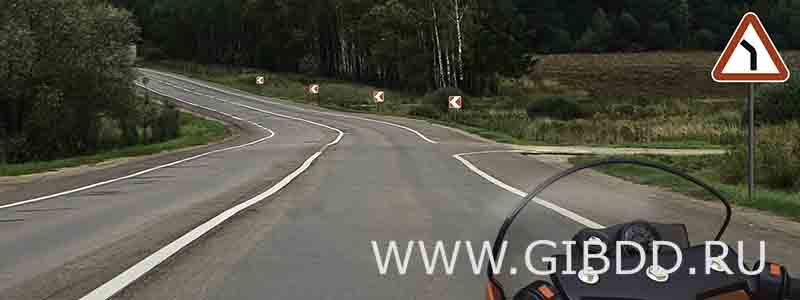

1. Разрешен. **Верный ответ.**

2. Разрешен только при технической неисправности транспортного средства.

3. Запрещен.

**Пояснение:** Эти знаки предупреждают о повороте основной дороги. Они не запрещают свернуть на другую дорогу. Поэтому на грунтовку справа повернуть можно - предупреждение и запрет здесь не одно и то же.

Знаки 1.11.2 и 1.34.2

## Билет 1 - вопрос 3

Можно ли Вам остановиться в указанном месте для посадки пассажира?

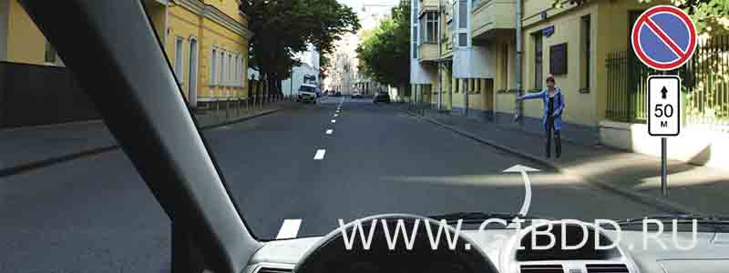

1. Можно. **Верный ответ.**

2. Можно, если Вы управляете такси.

3. Нельзя.

**Пояснение:** Не путай остановку со стоянкой. Здесь запрещена именно стоянка, а коротко остановиться для посадки пассажира можно. Смотри на знак внимательно: похожая картинка ещё не означает одинаковый запрет.

Знак 3.28

## Билет 1 - вопрос 4

Какие из указанных знаков запрещают движение водителям мопедов?

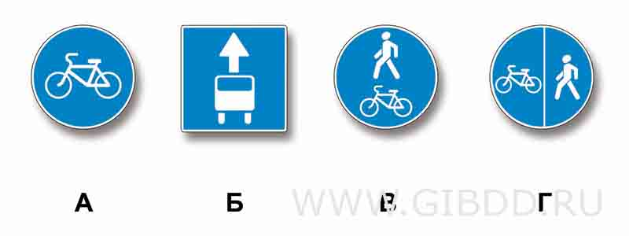

1. Только А.

2. Только Б.

3. В и Г.

4. Все. **Верный ответ.**

**Пояснение:** Мопеду не подходит ни один из этих маршрутов: велосипедная дорожка, дорожки для пешеходов и велосипедистов и полоса для маршрутного транспорта. Здесь важно проверить каждый знак, а не выбрать только тот, который кажется самым очевидным.

ПДД, п. 1.2 и 18.2; знаки 4.4.1, 4.5.2, 4.5.4 и 5.14.1

## Билет 1 - вопрос 5

Вы намерены повернуть налево. Где следует остановиться, чтобы уступить дорогу легковому автомобилю?

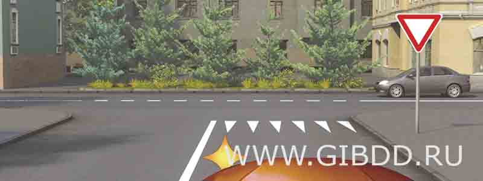

1. Перед знаком.

2. Перед перекрестком у линии разметки. **Верный ответ.**

3. На перекрестке перед прерывистой линией разметки.

4. В любом месте по усмотрению водителя.

**Пояснение:** Треугольники на асфальте показывают место, где нужно остановиться, если требуется уступить дорогу. Не у самого знака и не посреди перекрёстка: остановись перед перекрёстком у этой разметки и пропусти легковую машину.

Знак 2.4, разметка 1.13

## Билет 1 - вопрос 6

Что означает мигание зеленого сигнала светофора?

1. Предупреждает о неисправности светофора.

2. Разрешает движение и информирует о том, что вскоре будет включен запрещающий сигнал. **Верный ответ.**

3. Запрещает дальнейшее движение.

**Пояснение:** Мигающий зелёный ещё разрешает движение. Просто он предупреждает: скоро включится запрещающий сигнал. Это повод оценить обстановку, а не команда срочно давить на газ.

ПДД, п. 6.2

## Билет 1 - вопрос 7

Водитель обязан подавать сигналы световыми указателями поворота (рукой):

1. Перед началом движения или перестроением.

2. Перед поворотом или разворотом.

3. Перед остановкой.

4. Во всех перечисленных случаях. **Верный ответ.**

**Пояснение:** Начинаешь движение, перестраиваешься, поворачиваешь, разворачиваешься или останавливаешься - заранее сообщи об этом другим. Обычно поворотником, а если он отсутствует или сломан - рукой. Поэтому подходят все перечисленные случаи.

ПДД, п. 8.1

## Билет 1 - вопрос 8

Как Вам следует поступить при повороте направо?

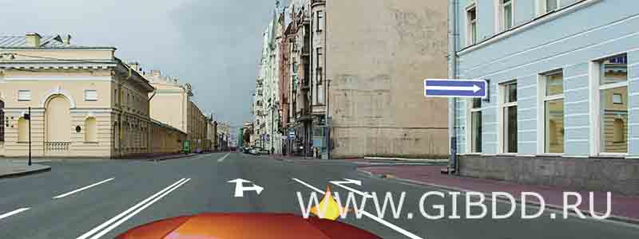

1. Перестроиться на правую полосу, затем осуществить поворот.

2. Продолжить движение по второй полосе до перекрестка, затем повернуть.

3. Возможны оба варианта действий. **Верный ответ.**

**Пояснение:** Здесь стрелки на полосах разрешают повернуть направо и с левой полосы. Можно заранее перестроиться вправо, а можно продолжить по левой и повернуть с неё. Главное - смотреть на разрешённые направления по полосам, а не применять обычную схему вслепую.

ПДД, п. 8.5; разметка 1.18

## Билет 1 - вопрос 9

По какой траектории Вам разрешено выполнить разворот?

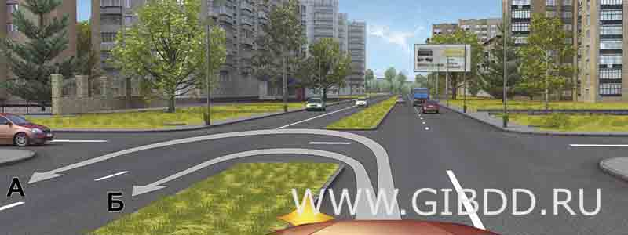

1. Только по А. **Верный ответ.**

2. Только по Б.

3. По любой из указанных.

**Пояснение:** При таком развороте часть пути проходит по участку с двусторонним движением. На нём нужно держаться правой стороны. Траектория А это условие выполняет, другая уводит на встречную сторону.

ПДД, п. 1.4

## Билет 1 - вопрос 10

С какой скоростью Вы можете продолжить движение вне населенного пункта по левой полосе на легковом автомобиле?

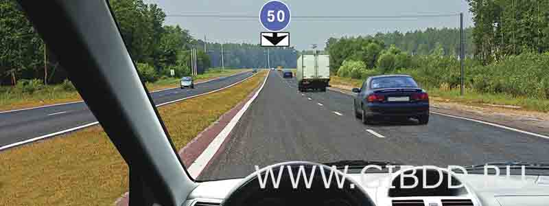

1. Не более 50 км/ч.

2. Не менее 50 км/ч и не более 70 км/ч.

3. Не менее 50 км/ч и не более 90 км/ч. **Верный ответ.**

**Пояснение:** Знак задаёт минимум для левой полосы - 50 км/ч. Но общий максимум для легковой машины на этой загородной дороге остаётся 90 км/ч: это не автомагистраль. Собираем оба ограничения вместе и получаем от 50 до 90 км/ч.

ПДД, п. 10.3; знак 4.6 и табличка 8.14

## Билет 1 - вопрос 11

Можно ли водителю легкового автомобиля выполнить опережение грузовых автомобилей вне населенного пункта по такой траектории?

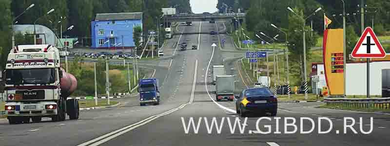

1. Можно. **Верный ответ.**

2. Можно, если скорость грузовых автомобилей менее 30 км/ч.

3. Нельзя.

**Пояснение:** За городом нужно по возможности держаться правее. Но между этими грузовиками небольшие промежутки: можно последовательно опередить их, как показано на рисунке. Возвращаться вправо после каждого грузовика здесь не требуется.

ПДД, п. 9.4

## Билет 1 - вопрос 12

В каком случае водителю разрешается поставить автомобиль на стоянку в указанном месте?

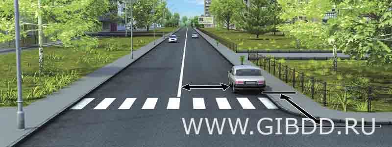

1. Только если расстояние до сплошной линии разметки не менее 3 м.

2. Только если расстояние до края пересекаемой проезжей части не менее 5 м.

3. При соблюдении обоих перечисленных условий. **Верный ответ.**

**Пояснение:** Здесь нужны оба расстояния одновременно: до края пересекаемой проезжей части - не меньше 5 метров, до сплошной линии - не меньше 3 метров. Одного выполненного условия мало. Проверь оба - тогда стоянка допустима.

ПДД, п. 12.4 и 12.5

## Билет 1 - вопрос 13

При повороте направо Вы должны уступить дорогу:

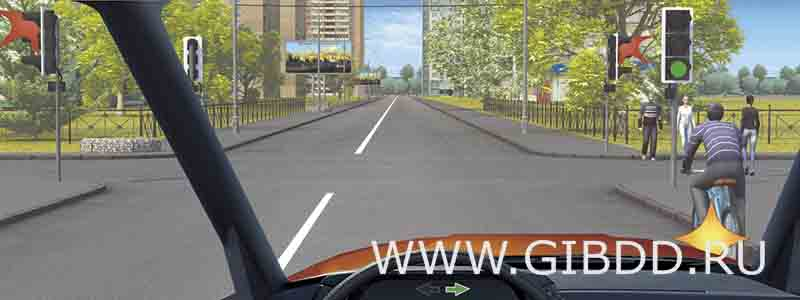

1. Только велосипедисту.

2. Только пешеходам.

3. Пешеходам и велосипедисту. **Верный ответ.**

4. Никому.

**Пояснение:** Зелёный разрешает повернуть, но не отменяет обязанность пропустить других. При повороте направо пропускаешь пешеходов на дороге, куда поворачиваешь, и велосипедиста впереди. Поэтому уступить нужно обоим.

ПДД, п. 8.6 и 13.1

## Билет 1 - вопрос 14

Вы намерены проехать перекресток в прямом направлении. Кому Вы должны уступить дорогу?

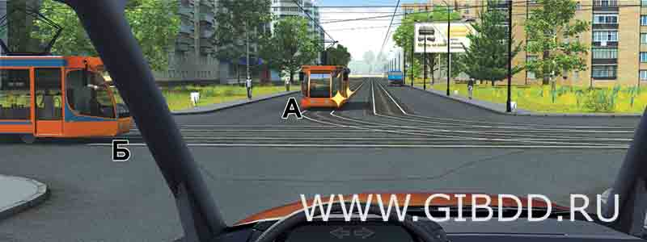

1. Обоим трамваям. **Верный ответ.**

2. Только трамваю А.

3. Только трамваю Б.

4. Никому.

**Пояснение:** Это перекрёсток равнозначных дорог. В такой ситуации трамвай имеет преимущество перед автомобилем независимо от направления движения. Поэтому сначала проходят оба трамвая, потом ты.

ПДД, п. 13.11

## Билет 1 - вопрос 15

Кому Вы обязаны уступить дорогу при повороте налево?

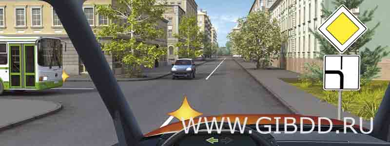

1. Только автобусу.

2. Только легковому автомобилю.

3. Никому. **Верный ответ.**

**Пояснение:** Ты и автобус едете по главной дороге. Между вами работают правила равнозначных дорог: для автобуса ты справа, значит он уступает. Легковая машина находится на второстепенной и тоже уступает. В этой ситуации пропускать никого не нужно.

ПДД, п. 13.9, 13.10 и 13.11

## Билет 1 - вопрос 16

С какой максимальной скоростью можно продолжить движение за знаком?

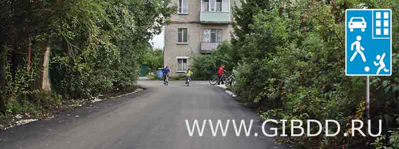

1. 60 км/ч.

2. 50 км/ч.

3. 30 км/ч.

4. 20 км/ч. **Верный ответ.**

**Пояснение:** Знак означает въезд в жилую зону. Здесь максимум - 20 км/ч. Не обычные городские 60: во дворах и жилых зонах действует своё ограничение.

ПДД, п. 10.2; знак 5.21

## Билет 1 - вопрос 17

Для перевозки людей на мотоцикле водитель должен иметь водительское удостоверение на право управления транспортными средствами:

1. Категории «A» или подкатегории «A1».

2. Любой категории или подкатегории в течение двух и более лет.

3. Только категории «A» или подкатегории «A1» в течение двух и более лет. **Верный ответ.**

**Пояснение:** Чтобы перевозить пассажира на мотоцикле, нужны права категории A или подкатегории A1 уже не меньше двух лет. Любая другая категория и просто общий водительский стаж это условие не заменяют.

ПДД, п. 22.2¹

## Билет 1 - вопрос 18

При какой неисправности разрешается эксплуатация транспортного средства?

1. Не работают запорные устройства топливных баков.

2. Не работают механизм регулировки и фиксирующее устройство сиденья водителя.

3. Не работает устройство обдува ветрового стекла.

4. Не работает стеклоподъемник. **Верный ответ.**

**Пояснение:** Из перечисленного неработающий стеклоподъёмник не запрещает эксплуатацию машины. Остальные варианты - неисправности из запрещающего перечня. Сравниваем конкретные поломки, а не выбираем ту, с которой кажется удобнее ехать.

Перечень неисправностей, п. 8.3 и 9.2

## Билет 1 - вопрос 19

В случае, когда правые колеса автомобиля наезжают на неукрепленную влажную обочину, рекомендуется:

1. Затормозить и полностью остановиться.

2. Затормозить и плавно направить автомобиль на проезжую часть.

3. Не прибегая к торможению, плавно направить автомобиль на проезжую часть. **Верный ответ.**

**Пояснение:** На мокрой обочине сцепление правых и левых колёс разное. Резкое торможение может спровоцировать занос. В этой ситуации не тормози: плавно направь машину обратно на проезжую часть.

Безопасность управления автомобилем

## Билет 1 - вопрос 20

Что понимается под временем реакции водителя?

1. Время с момента обнаружения водителем опасности до полной остановки транспортного средства.

2. Время с момента обнаружения водителем опасности до начала принятия мер по ее избежанию. **Верный ответ.**

3. Время, необходимое для переноса ноги с педали управления подачей топлива на педаль тормоза.

**Пояснение:** Время реакции - промежуток между «увидел опасность» и «начал действовать». Торможение и остановка машины происходят уже после этого. Здесь спрашивают именно задержку до начала действий.

Основы безопасности движения
